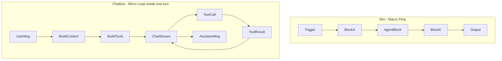
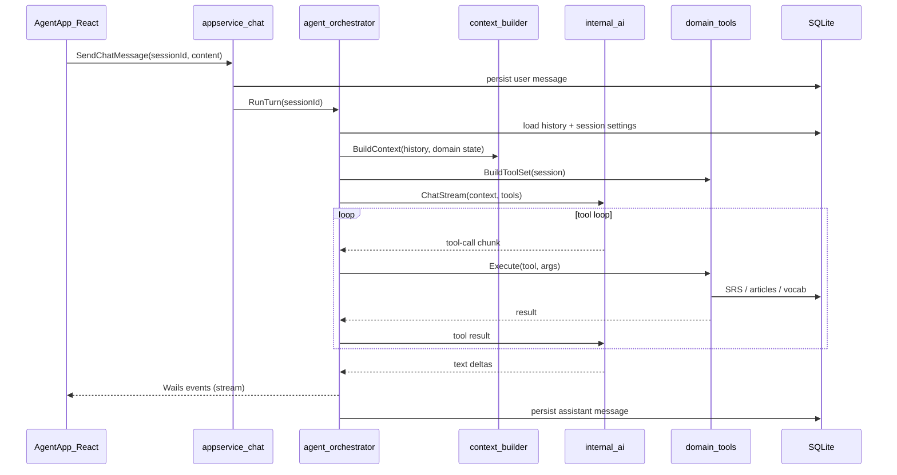

# Agent Flow Design: Sim vs Chatbox

## What these two repos actually are

They solve **different layers** of "agent" problems. Treating them as competitors leads to the wrong design; they are complementary reference models.

| Dimension | [Sim](https://github.com/simstudioai/sim) | [Chatbox](https://github.com/chatboxai/chatbox) |
|-----------|-------------------------------------------|--------------------------------------------------|
| **Primary metaphor** | Workflow = visual program (recipe) | Conversation = interactive session |
| **Unit of execution** | Block in a compiled DAG | Message turn in a chat stream |
| **Agent definition** | Agent block = one reasoning step inside a workflow | Whole chat session = agent loop (model + tools + memory) |
| **Flow control** | Graph topology (Condition, Router, Loop, Parallel) | Model-driven ReAct loop (tool-call → result → continue) |
| **Runtime** | Server-side executor + Trigger.dev jobs | Client-side orchestration (Electron renderer) |
| **Best for** | Repeatable multi-step automation, HITL pipelines, fan-out | Interactive Q&A, tutoring, ad-hoc tool use |

For **Talus Echo conversational assistant**, Chatbox is the primary blueprint. Sim teaches orchestration patterns worth borrowing only where you need deterministic multi-step pipelines (e.g., "generate 10 example sentences → validate → import to SRS deck").

---

## Core design principle 1: Two-level agent model

Both repos separate **macro flow** from **micro reasoning**.



**Sim:** An "agent" is a **workflow** whose thinking happens in one or more **Agent blocks**. Blocks are steps; tools are capabilities the model invokes *inside* a step. The same integration can run as a deterministic block ("always send Slack here") or as an agent tool ("model decides when to Slack"). See [Sim Agents docs](https://docs.sim.ai/agents) and [Tools docs](https://docs.sim.ai/tools).

**Chatbox:** The entire chat turn is one **orchestration pipeline**: context → tools → stream → persist. Tool calling is the inner loop; there is no separate workflow graph for normal chat. Entry point: `orchestrateGeneration()` in [`orchestration.ts`](https://github.com/chatboxai/chatbox/blob/main/src/renderer/stores/session/orchestration.ts).

**Takeaway for Talus Echo:** Build one **orchestrator** (Go-side, not UI-side) that owns the conversational loop. Domain actions (explain word, query SRS deck, fetch article context) are **tools**, not scattered handler branches in the UI.

---

## Core design principle 2: Orchestration vs execution separation

### Sim pattern — compile graph, dispatch handlers

Sim's executor ([blog post](https://www.sim.ai/blog/executor)) follows three rules:

1. **Compile** visual workflow → DAG (loops/parallel expand to sentinel nodes; acyclic graph preserved)
2. **Dispatch** via event-driven ready queue (parallelism emerges from satisfied dependencies, not explicit "run parallel" flags)
3. **Execute** via `BlockHandler` interface — orchestration never contains business logic

Key subsystems: `ExecutionEngine`, `LoopOrchestrator`, `ParallelOrchestrator`, `NodeExecutionOrchestrator`, variable resolver with scoped references (`<block.field>`, `<loop.item>`, `<parallel.index>`).

Also notable: **snapshot pause/resume** for human-in-the-loop without replaying the whole workflow.

### Chatbox pattern — pipeline stages, single turn

Chatbox's orchestration is a **linear pipeline** with one streaming inner loop:

```
orchestrateGeneration
  → buildContext (history, attachments, compaction)
  → buildToolsForSession (conditional tool assembly)
  → model.chatStream (async generator)
  → processStreamChunk (state machine: text | reasoning | tool-call | tool-result | error)
  → persistStreamingMessage
```

Documented in [`docs/technical/tools-and-integrations.md`](https://github.com/chatboxai/chatbox/blob/main/docs/technical/tools-and-integrations.md). Tool layers merge into one Vercel AI SDK `ToolSet`: MCP servers, built-in toolsets (file, knowledge-base, web-search), and Agent Skills (`load_skill`).

**Takeaway for Talus Echo:** Mirror Chatbox's stage separation in Go:

```
internal/agent/
  orchestrator.go    # SendChatMessage → full turn
  context.go         # build message history + domain context
  tools.go           # assemble tool definitions per session/settings
  stream.go          # LLM stream + tool-call loop
  tools/             # explain_word, lookup_card, get_article, etc.
```

Keep [`internal/appservice/chat.go`](internal/appservice/chat.go) thin — it should delegate to `internal/agent/`, not embed LLM logic.

---

## Core design principle 3: Tools are capabilities, not flow steps

Both repos enforce: **blocks/steps ≠ tools/actions**.

| Mode | When | Who decides |
|------|------|-------------|
| **Deterministic step** | Fixed pipeline, repeatable side effects | Developer (graph position or explicit call) |
| **Agent tool** | Context-dependent actions | Model at runtime |
| **Hybrid** | Tool with `Force`/`Auto`/`None` controls (Sim) or capability-gated assembly (Chatbox) | Developer sets bounds; model chooses within them |

Chatbox adds **capability-adaptive execution**:

- `model.isSupportToolUse('knowledge-base' | 'web-browsing' | 'read-file')` gates which tools are registered
- Models without native tool support get **prompt-engineering fallback** (`applyLegacyToolFallback`)
- MCP tools namespaced as `mcp__{server}__{tool}` to avoid collisions

**Takeaway for Talus Echo:** Define a small initial toolset aligned with your product ([`docs/design-and-plan.md`](docs/design-and-plan.md) AI service):

- `explain_word` — contextual vocabulary explanation (Reading page parity)
- `lookup_vocabulary` — search user's saved words / SRS state
- `get_due_cards` — today's review queue summary
- `save_to_deck` — clip word → create SRS card (Phase 2 flow)

Register tools based on session context (e.g., only expose article tools when a reading session is active).

---

## Core design principle 4: Streaming is a first-class state machine

Chatbox treats streaming as structured **content parts**, not a plain string buffer:

- `text`, `reasoning`, `tool-call` (states: `call` → `result` | `error`), `image`, `info`
- `processStreamChunk` in [`stream-chunk-processor.ts`](https://github.com/chatboxai/chatbox/blob/b45fc528/src/renderer/stores/session/stream-chunk-processor.ts) is the single reducer for stream events
- UI components (`ToolCallPartUI`) render per-part state; errors use structured `errorCode` → i18n

Sim streams execution via **SSE** from server executor to client — block start/complete, streaming content, routing decisions — so the canvas reflects live DAG progress.

**Takeaway for Talus Echo:** Your current UI ([`frontend/src/AgentApp.tsx`](frontend/src/AgentApp.tsx)) uses request/response (`SendChatMessage` returns both messages at once). For conversational UX, plan:

1. **Backend:** Wails events or chunked binding for stream deltas + tool-call events
2. **Frontend:** Message model with `contentParts[]` (not just `content: string`)
3. **Reducer:** One function to fold stream chunks into message state (Chatbox pattern)

Current echo stub:

```128:128:internal/appservice/chat.go
	assistantContent := "Echo: " + content
```

Replace with orchestrator that streams and persists incrementally.

---

## Core design principle 5: Context is assembled, not passed raw

Chatbox's `buildContext` (shared `@shared/context`) handles:

- Message history truncation (`maxContextMessageCount`)
- **Compaction points** (summarize older turns)
- Attachment inlining vs tool-based file access (large files → tools; small → inline)
- OCR fallback for non-vision models

Sim's variable resolver handles **scoped references** across workflow blocks, loops, and parallel branches.

**Takeaway for Talus Echo:** Before each LLM call, run a **context builder** that injects:

- System persona (English tutor for Chinese programmers — from your design doc persona)
- Active reading article excerpt (if user is in Reading context)
- User level / daily goal from config
- Recent SRS performance summary (optional, token-budgeted)

Do not send the full SQLite history every turn.

---

## Core design principle 6: Provider abstraction at the model boundary

Chatbox: `ModelInterface` + provider registry → `createModel(settings)` → `chatStream()`. Each provider declares capabilities (`isSupportToolUse`, `isSupportVision`, `isSupportSystemMessage`).

Sim: Agent block selects provider/model per step; supports 15+ providers + Ollama/vLLM; structured output via JSON Schema on Agent block.

Your planned [`internal/ai/`](docs/design-and-plan.md) already aligns with this. Extend it with:

- `ChatStream(ctx, messages, tools, opts) (<-chan StreamPart, error)`
- Capability flags per provider
- Unified error type for UI

---

## Core design principle 7: Extensibility via MCP (optional but proven)

Chatbox's MCP layer ([`mcpController`](https://github.com/chatboxai/chatbox/blob/main/src/renderer/setup/mcp_bootstrap.ts)):

- Bootstraps servers from settings at startup
- Stdio via Electron main process IPC; HTTP for web/mobile
- Aggregates tools into session toolset; tolerates per-tool failures

Sim also deploys workflows as MCP servers and consumes external MCP tools in Agent blocks.

**Takeaway for Talus Echo:** MCP is optional for v1. Start with **native Go tools** wired to your SRS/Reading services. Add MCP later if you want user-installable extensions without app updates.

---

## Architecture recommendation for Talus Echo (conversational)



### What to borrow from each repo

**From Chatbox (primary):**
- Orchestration pipeline: context → tools → stream → persist
- Content-part message model + stream chunk processor
- Conditional tool assembly + capability detection
- Session-scoped settings (model, web browse, knowledge base equivalents)
- Graceful tool error handling (don't crash the turn)

**From Sim (selective, when needed):**
- `BlockHandler`-style split: orchestrator never implements tool business logic
- Structured JSON output schema for deterministic downstream steps (e.g., `{ word, definition, example }` before saving to SRS)
- Pause/resume snapshot pattern if you add "approve before adding to deck"
- DAG thinking only if you later add **background workflows** (batch import, content generation pipelines) separate from chat

### What NOT to copy

- Sim's full ReactFlow + DAG executor — overkill for chat-first tutoring
- Chatbox's renderer-side orchestration — your Go backend should own the loop (API keys, SRS access, consistency)
- Chatbox's Electron MCP stdio IPC — defer until extensibility is a requirement

---

## Suggested investigation order (when you read the repos)

### Chatbox — read in this sequence

1. [`src/renderer/stores/session/orchestration.ts`](https://github.com/chatboxai/chatbox/blob/main/src/renderer/stores/session/orchestration.ts) — the turn lifecycle
2. [`src/renderer/stores/session/tools-builder.ts`](https://github.com/chatboxai/chatbox/blob/main/src/renderer/stores/session/tools-builder.ts) — conditional tool assembly
3. [`src/renderer/stores/session/stream-chunk-processor.ts`](https://github.com/chatboxai/chatbox/blob/main/src/renderer/stores/session/stream-chunk-processor.ts) — stream state machine
4. [`src/renderer/packages/model-calls/stream-text.ts`](https://github.com/chatboxai/chatbox/blob/main/src/renderer/packages/model-calls/stream-text.ts) — model + tool loop
5. [`docs/technical/tools-and-integrations.md`](https://github.com/chatboxai/chatbox/blob/main/docs/technical/tools-and-integrations.md) — tool layer architecture
6. [`src/shared/context/`](https://github.com/chatboxai/chatbox/tree/main/src/shared/context) — context building

### Sim — read in this sequence

1. [Workflows overview](https://docs.sim.ai/workflows) + [Agent block](https://docs.sim.ai/blocks/agent) — mental model
2. [Execution overview](https://docs.sim.ai/execution) — how runs work
3. [Executor blog post](https://www.sim.ai/blog/executor) — DAG + ready queue (deep dive)
4. `apps/sim/executor/` in repo — `execution/state.ts`, `orchestrators/`, `handlers/`
5. [Agents vs tools vs MCP](https://docs.sim.ai/agents/mcp) — when model decides vs deterministic

---

## Mapping to your current codebase

| Existing | Gap vs target |
|----------|---------------|
| [`AgentApp.tsx`](frontend/src/AgentApp.tsx) — sessions, thread, input | No streaming, no tool-call UI, no content parts |
| [`chat.go`](internal/appservice/chat.go) — CRUD + echo | No LLM, no orchestrator, no tool loop |
| [`docs/design-and-plan.md`](docs/design-and-plan.md) — `internal/ai/` planned | Needs `ChatStream` + tool interface, not just one-shot HTTP |
| Wails dual-window (agent + management) | Good separation; agent window stays chat-focused |

---

## Recommended implementation phases (conversational path)

**Phase A — Minimal real agent (no tools)**
- Replace echo with `internal/ai` streaming call
- Wails event for stream deltas; frontend renders incrementally
- System prompt: English tutor persona

**Phase B — Domain tools**
- `internal/agent/tools/` calling existing/planned SRS and reading services
- Tool-call loop in orchestrator (max iterations guard)
- Frontend: tool-call parts in message bubble

**Phase C — Context intelligence**
- Context builder with compaction + reading-session injection
- Structured output for `save_to_deck` confirmation flow

**Phase D (optional) — Sim-inspired workflows**
- Background non-chat pipelines (e.g., nightly vocabulary generation) as separate DAG runner, not in chat UI

---

## One-sentence summary

**Chatbox teaches you how to run a conversational agent loop (context → tools → stream → persist); Sim teaches you how to orchestrate multi-step deterministic pipelines (compile → DAG → handlers). For Talus Echo's chat tutor, implement Chatbox's orchestration pattern in Go, borrow Sim's separation of orchestration from execution, and add Sim-style structured workflows only when chat alone is insufficient.**
