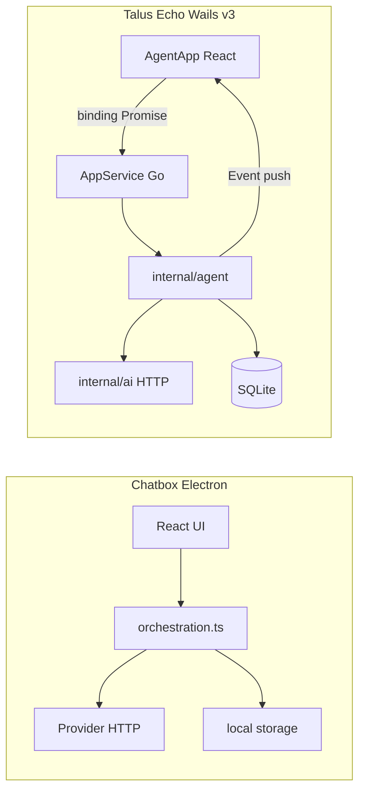
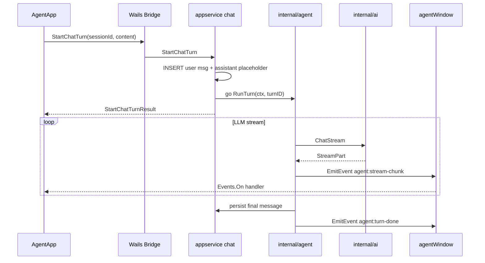
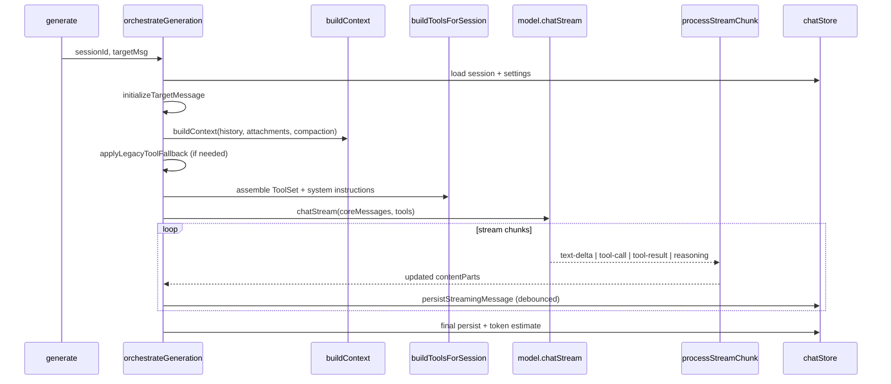

# Chatbox-Only Agent Flow Design for Talus Echo

## Scope

This plan uses **[Chatbox](https://github.com/chatboxai/chatbox)** as the sole reference for designing Talus Echo's conversational agent. Sim and workflow-DAG patterns are out of scope.

Your target: **chat-first English tutor** with a tool loop (explain words, query SRS, save vocabulary), built on the existing Wails v3 scaffold ([`main.go`](main.go), [`frontend/src/AgentApp.tsx`](frontend/src/AgentApp.tsx), [`internal/appservice/chat.go`](internal/appservice/chat.go)).

**Wails v3 reference:** [Architecture](https://v3.wails.io/concepts/architecture/) · [Bridge](https://v3.wails.io/concepts/bridge/) · [Events](https://v3.wails.io/features/events/system/) · [Lifecycle](https://v3.wails.io/concepts/lifecycle/)

---

## Wails v3: how the agent fits this framework

### What you already have

Talus Echo is a standard Wails v3 app (`github.com/wailsapp/wails/v3 v3.0.0-alpha.60`):

| Component | Current usage | Relevant files |
|-----------|---------------|----------------|
| **Service + bridge** | One `AppService` struct; exported methods → auto TypeScript bindings | [`main.go`](main.go), [`appservice.go`](appservice.go) |
| **Dual windows** | Agent (`/agent`) + Management (`/`) in one embedded SPA | [`windows.go`](windows.go), [`frontend/src/main.tsx`](frontend/src/main.tsx) |
| **Frontend runtime** | `@wailsio/runtime` + Vite plugin generates `./bindings` | [`frontend/vite.config.ts`](frontend/vite.config.ts) |
| **Persistence** | SQLite via Go; chat CRUD via `AppService` bindings | [`internal/appservice/chat.go`](internal/appservice/chat.go) |
| **Events** | Not used yet | — |

This matches Wails v3's intended model: **Go owns state, network, DB, and long-running work**; **WebView owns UI**; **bridge** connects them in-memory ([architecture docs](https://v3.wails.io/concepts/architecture/)).

### Chatbox vs Wails: the key architectural shift

Chatbox runs the full orchestration loop in the **Electron renderer** (`orchestrateGeneration` in TypeScript). Wails inverts this:



**Why Go-side orchestration is correct for Wails:**
- API keys and provider config stay in Go ([`internal/config`](internal/config))
- Tools call SRS/Reading services without crossing the bridge twice
- SQLite writes are synchronous and safe in one process
- Wails explicitly recommends **bindings for request/response** and **events for streaming/progress** ([bridge docs](https://v3.wails.io/concepts/bridge/))

### Wails bridge constraints that shape the agent API

The bridge **cannot** pass Go channels, functions, or streaming iterators to JavaScript. Unsupported types force workarounds ([bridge reference](https://v3.wails.io/concepts/bridge/)).

| Pattern | Supported? | Use for agent |
|---------|------------|---------------|
| `await AppService.Method(args)` → result | Yes | Start turn, cancel turn, list sessions |
| Return `<-chan StreamPart` from binding | **No** | Do not try |
| `app.Event.Emit(name, data)` → `Events.On` | **Yes** | Stream text-delta, tool-call, turn-done |
| `window.EmitEvent(name, data)` | **Yes** | Target agent window only |
| `ctx context.Context` as first method arg | Yes | Auto-cancel when caller disconnects |
| Goroutine + emit events | Yes | Long-running LLM turn |

**Rule:** One binding kicks off the turn; events push incremental state. This is the same role Chatbox's `AsyncGenerator` + `processStreamChunk` play, split across Go (produce) and React (consume).

### Recommended Wails v3 agent API contract

#### Bindings (commands — request/response)

Extend [`AppService`](appservice.go) / [`internal/appservice/chat.go`](internal/appservice/chat.go):

```go
type StartChatTurnResult struct {
    UserMessage      store.ChatMessage `json:"user_message"`
    AssistantMessage store.ChatMessage `json:"assistant_message"` // generating=true
}

func (s *Service) StartChatTurn(sessionID, content string) (StartChatTurnResult, error)
func (s *Service) CancelChatTurn(sessionID, messageID string) error
```

Keep existing CRUD bindings: `ListChatSessions`, `ListChatMessages`, `CreateChatSession`, etc.

Optional: add `ctx context.Context` as the first parameter so Wails propagates cancellation when the WebView navigates away.

#### Events (notifications — server push)

| Event | Payload | When |
|-------|---------|------|
| `agent:stream-chunk` | `{ sessionId, messageId, chunk }` | Each text-delta, tool-call, tool-result |
| `agent:turn-done` | `{ sessionId, messageId, message }` | Turn completed |
| `agent:turn-error` | `{ sessionId, messageId, error }` | Turn failed |
| `agent:turn-cancelled` | `{ sessionId, messageId }` | User or context cancelled |

Emit via **agent window only** ([`windows.go`](windows.go)):

```go
func (wm *WindowManager) EmitAgentEvent(name string, data any) {
    if wm.agentWindow != nil {
        wm.agentWindow.EmitEvent(name, data)
    }
}
```

Use `app.Event.Emit` only for cross-window broadcasts (e.g. future `vocab:updated` for management UI).

#### Frontend hook

New `frontend/src/hooks/useAgentStream.ts` using `Events.On('agent:stream-chunk', ...)` with cleanup on unmount. Wire into [`AgentApp.tsx`](frontend/src/AgentApp.tsx): `StartChatTurn` + event-driven updates instead of synchronous `SendChatMessage`.

### End-to-end turn flow on Wails v3



### Go-side turn management

`internal/agent/registry.go` — `TurnRegistry` maps `messageID → context.CancelFunc`:

- `StartChatTurn` registers cancel, spawns goroutine with `context.WithCancel(app.Context())`
- `CancelChatTurn` invokes cancel
- Goroutine checks `ctx.Done()` between stream reads and tool executions
- `ServiceShutdown` cancels all active turns on app exit

### Where each Chatbox layer lives in Wails v3

| Chatbox module | Wails v3 location | Mechanism |
|----------------|-------------------|-----------|
| `orchestration.ts` | `internal/agent/orchestrator.go` | Go goroutine |
| `stream-chunk-processor.ts` | `internal/agent/stream_processor.go` | Pure Go reducer |
| `tools-builder.ts` | `internal/agent/tools_builder.go` | Pre-LLM assembly |
| `generation.ts` entry | `StartChatTurn` binding | Bridge call |
| `chatStore` | SQLite + chat bindings | Shared Go state |
| UI stream updates | `useAgentStream` + `AgentApp` | Events |
| `AbortController` | `CancelChatTurn` + TurnRegistry | Binding + context |
| Provider HTTP | `internal/ai/` | Never in frontend |

### Dual-window, lifecycle, performance

- **Agent window** subscribes to `agent:*`; **management window** does not unless chat is embedded there later
- Both windows share one `AppService` — no session sync needed
- **`ServiceShutdown`**: cancel turns, flush partial messages
- **Hidden agent window**: turns continue; events buffer until window is shown again
- **Stream perf**: emit deltas only (not full history); debounce SQLite writes (~2s); bridge overhead is negligible vs LLM latency

---

## What Chatbox is

Chatbox is an open-source **multi-platform AI client** (Electron + React, also web/mobile via Capacitor). It is not a workflow builder — it is a **conversation runtime** that:

- Manages sessions and message history locally
- Abstracts 10+ LLM providers behind a unified `ModelInterface`
- Streams responses incrementally
- Runs a **model-driven tool loop** (native tool calling + prompt fallback)
- Extends capabilities via MCP servers, built-in toolsets, and Agent Skills

Project layout (relevant parts):

```
chatbox/src/
├── main/           # Electron: MCP stdio subprocess, file I/O, sandbox
├── renderer/       # React UI + orchestration + model calls
├── shared/         # Types, context builder, provider contracts
└── preload/        # Secure IPC bridge
```

Key docs: `[docs/technical/tools-and-integrations.md](https://github.com/chatboxai/chatbox/blob/main/docs/technical/tools-and-integrations.md)`

---

## Chatbox's core agent flow (one chat turn)

Every user message triggers a single **orchestration pipeline**. The entry point is `orchestrateGeneration()` in `[orchestration.ts](https://github.com/chatboxai/chatbox/blob/main/src/renderer/stores/session/orchestration.ts)`.




### Design principles extracted from Chatbox

1. **Single orchestrator owns the turn** — UI never calls the LLM directly; it calls `generate()` → `orchestrateGeneration()`.
2. **Context is built, not dumped** — history is truncated, compacted, and attachments are inlined or tool-accessed based on size and model capability.
3. **Tools are assembled per turn** — which tools exist depends on session settings + model capabilities, not a static global list.
4. **Streaming is a state machine** — chunks fold into structured `contentParts[]`, not a growing string.
5. **Provider capabilities drive behavior** — vision, tool use, system messages each gate different code paths.
6. **Tool failures are soft** — a failed tool returns an error result to the model; the whole turn does not crash.
7. **Platform abstraction** — storage, config, and file access go through adapters so the same logic runs on desktop/web/mobile.

---

## Layer 1: Session and message model

**Chatbox files:**

- `[src/shared/types/session.ts](https://github.com/chatboxai/chatbox/blob/main/src/shared/types/session.ts)` — `Message`, content part types
- `[src/renderer/stores/chatStore.ts](https://github.com/chatboxai/chatbox/tree/main/src/renderer/stores)` — persistence
- `[generation.ts](https://github.com/chatboxai/chatbox/blob/main/src/renderer/stores/session/generation.ts)` — turn entry, fork/regenerate

**Message structure (Chatbox pattern):**


| Field            | Purpose                                                             |
| ---------------- | ------------------------------------------------------------------- |
| `role`           | `user` / `assistant` / `system`                                     |
| `contentParts[]` | Structured parts: `text`, `reasoning`, `tool-call`, `image`, `info` |
| `generating`     | In-flight flag while stream is active                               |
| `finishReason`   | Why the model stopped                                               |
| `tokensUsed`     | Post-hoc token estimate                                             |


**Tool-call part lifecycle:**

```
tool-call (state: call) → tool-result (state: result) | tool-error (state: error)
```

Handled by `[stream-chunk-processor.ts](https://github.com/chatboxai/chatbox/blob/b45fc528/src/renderer/stores/session/stream-chunk-processor.ts)`.

**Talus Echo mapping:**

Your current model is flat (`role` + `content` string in SQLite via `[chat.go](internal/appservice/chat.go)`). Evolve toward:

- Keep `content` for backward compatibility initially
- Add optional `content_parts` JSON column for tool-call UI
- Add `generating` / `finish_reason` columns on in-flight messages

Frontend `[ChatThread](frontend/src/components/agent/ChatThread.tsx)` / `[MessageBubble](frontend/src/components/agent/MessageBubble.tsx)` should render `contentParts` when present.

---

## Layer 2: Context builder

**Chatbox files:**

- `[src/shared/context/](https://github.com/chatboxai/chatbox/tree/main/src/shared/context)` — shared `buildContext()`
- `[generation.ts](https://github.com/chatboxai/chatbox/blob/main/src/renderer/stores/session/generation.ts)` — `genMessageContext()` wrapper

**What `buildContext` does before each LLM call:**

- Takes full message history up to the target assistant message
- Applies **compaction points** (summarize older turns to save tokens)
- Resolves attachments: small files inline, large files deferred to `read_file` tool
- Respects `maxContextMessageCount` from session settings
- Sequences messages for provider-specific ordering rules

**Talus Echo mapping — `internal/agent/context.go`:**

Inject domain context into system prompt or early user context:

- Persona: English tutor for Chinese-speaking programmers (from `[docs/design-and-plan.md](docs/design-and-plan.md)`)
- User level / daily goal from config service
- Active reading article excerpt (when user opened agent from Reading page — future)
- Recent SRS stats summary (token-budgeted, optional)

Do not send full chat history unbounded — mirror Chatbox's truncation/compaction.

---

## Layer 3: Tool system

**Chatbox architecture** (`[docs/technical/tools-and-integrations.md](https://github.com/chatboxai/chatbox/blob/main/docs/technical/tools-and-integrations.md)`):

Three tool layers merge into one Vercel AI SDK `ToolSet` at call time:


| Layer             | Location                         | Examples                         |
| ----------------- | -------------------------------- | -------------------------------- |
| MCP servers       | `packages/mcp/controller.ts`     | External tools via stdio/HTTP    |
| Built-in toolsets | `packages/model-calls/toolsets/` | file, knowledge-base, web-search |
| Agent Skills      | `load_skill` tool                | On-demand instruction packages   |


**Assembly logic — `buildToolsForSession()`** (`[tools-builder.ts](https://github.com/chatboxai/chatbox/blob/main/src/renderer/stores/session/tools-builder.ts)`):

1. Check `model.isSupportToolUse()` and scoped capabilities (`read-file`, `web-browsing`, `knowledge-base`)
2. Merge MCP tools from running servers
3. Conditionally add file / web / knowledge-base toolsets
4. Collect each toolset's `description` string → inject into system prompt
5. Return `{ tools, instructions }`

**Dual-mode execution** (`[stream-text.ts](https://github.com/chatboxai/chatbox/blob/b45fc528/src/renderer/packages/model-calls/stream-text.ts)`):

- **Native tool use:** tools passed to model API; model emits `tool-call` chunks; runtime executes and feeds back `tool-result`
- **Legacy fallback:** `applyLegacyToolFallback()` uses prompt engineering when model lacks native tool support

**Talus Echo v1 tools (Go-native, no MCP yet):**


| Tool                | Purpose                            | Gates                                   |
| ------------------- | ---------------------------------- | --------------------------------------- |
| `explain_word`      | Contextual word/phrase explanation | Always when model supports tools        |
| `lookup_vocabulary` | Search user's saved words          | When vocab DB has data                  |
| `get_due_cards`     | Today's SRS review summary         | When SRS module exists                  |
| `save_to_deck`      | Create SRS card from clip          | Requires user confirmation in tool args |


Define in `internal/agent/tools/` with a shared interface:

```go
type Tool interface {
    Name() string
    Description() string
    Parameters() json.RawMessage // JSON Schema
    Execute(ctx context.Context, args json.RawMessage) (any, error)
}
```

Registry assembled per session in `internal/agent/tools_builder.go` — mirror Chatbox's conditional assembly.

**Defer MCP** until you need user-installable extensions without app updates.

---

## Layer 4: Model provider abstraction

**Chatbox files:**

- `[src/shared/models/types.ts](https://github.com/chatboxai/chatbox/tree/main/src/shared/models)` — `ModelInterface`, `ChatStreamOptions`, `ModelStreamPart`
- `[src/renderer/adapters/](https://github.com/chatboxai/chatbox/tree/main/src/renderer/adapters)` — `createModel(settings)`
- Provider registry pattern in `src/shared/providers/registry.ts`

**Key interface methods:**

- `chatStream(messages, options) → AsyncGenerator<ModelStreamPart>`
- `isSupportToolUse(scope?) → bool`
- `isSupportVision() → bool`
- `isSupportSystemMessage() → bool`

**Talus Echo mapping — extend planned `[internal/ai/](docs/design-and-plan.md)`:**

```go
type StreamPart struct {
    Type string // text-delta, tool-call, tool-result, finish, error
    // ... typed fields
}

type ChatClient interface {
    ChatStream(ctx context.Context, req ChatRequest) (<-chan StreamPart, error)
    Capabilities() ModelCapabilities
}
```

Providers: OpenAI, Claude, DeepSeek, Ollama (align with your design doc). Capability flags drive tool registration and context inlining — same as Chatbox.

---

## Layer 5: Streaming and persistence

**Chatbox pattern:**

- `model.chatStream()` yields chunks
- `processStreamChunk()` reduces chunks into `StreamProcessorState` (contentParts, usage, finishReason)
- UI updated via `updateStreamingCache()` every chunk; `persistStreamingMessage()` debounced every 2s
- Abort via `AbortController` attached to message as `cancel()`

**Error handling:**

- Tool errors → `tool-error` chunk → part state `error` with structured `errorCode`
- Generation errors → `handleGenerationError()` → user-visible message
- Abort → mark `generating: false`, persist partial content

**Talus Echo mapping (Wails v3):**

Current flow is synchronous via binding:

```101:118:internal/appservice/chat.go
func (s *Service) SendChatMessage(sessionID, content string) (SendChatMessageResult, error) {
  // ... persist user msg, echo assistant, return both
}
```

Replace with the **binding + events** split described in the Wails v3 section above:

1. `StartChatTurn` binding — persist user msg + assistant placeholder, return immediately
2. Goroutine runs `internal/agent.RunTurn`
3. `agentWindow.EmitEvent("agent:stream-chunk", ...)` per chunk
4. Debounced SQLite persist during stream (Chatbox: ~2s interval)
5. `agent:turn-done` with final message; UI clears `sending` state
6. `CancelChatTurn` binding aborts via `TurnRegistry`

---

## Layer 6: UI architecture

**Chatbox files:**

- `[ToolCallPartUI.tsx](https://github.com/chatboxai/chatbox/blob/b45fc528/src/renderer/components/message-parts/ToolCallPartUI.tsx)` — tool state visualization
- `[MessageBubble](https://github.com/chatboxai/chatbox/tree/main/src/renderer/components)` — multi-part rendering
- Session sidebar, input draft management, keyboard shortcuts

**Talus Echo already has:**

- `[SessionSidebar.tsx](frontend/src/components/agent/SessionSidebar.tsx)` — session list, rename, delete
- `[ChatInput.tsx](frontend/src/components/agent/ChatInput.tsx)` — send with disabled/sending states
- `[ChatThread.tsx](frontend/src/components/agent/ChatThread.tsx)` — message list

**Gaps to close:**

- Streaming text rendering (typewriter / incremental markdown)
- Tool-call part UI (loading → success/error states)
- Cancel button during generation
- Regenerate / edit-and-resend (Chatbox fork model — defer to v2)

---

## Recommended Go package layout (Chatbox-inspired)

```
internal/agent/
  orchestrator.go      # RunTurn — mirrors orchestrateGeneration
  context.go           # BuildContext — history + domain injection
  tools_builder.go     # BuildToolSet — conditional assembly
  stream_processor.go  # Fold StreamPart → content parts (mirror processStreamChunk)
  tools/
    registry.go
    explain_word.go
    lookup_vocabulary.go
    get_due_cards.go
    save_to_deck.go

internal/ai/
  client.go            # ChatStream interface
  openai.go / claude.go / ollama.go
  capabilities.go

internal/appservice/
  chat.go              # Thin: CRUD + delegate RunTurn to agent orchestrator
```

Chatbox keeps orchestration in the **renderer** because it is an Electron client. **Wails v3 requires Go-side orchestration** with events for push updates — see the Wails v3 section at the top of this plan.

---

## Implementation phases

### Phase A — Wails streaming shell (no tools)

- Define `StartChatTurn` / `CancelChatTurn` bindings + `agent:*` event contract
- Add `WindowManager.EmitAgentEvent` in [`windows.go`](windows.go)
- `internal/ai.ChatStream` with one provider
- `internal/agent/orchestrator.go` + `TurnRegistry`
- `useAgentStream` hook in frontend; update [`AgentApp.tsx`](frontend/src/AgentApp.tsx)
- System prompt: tutor persona

### Phase B — Tool loop

- Tool registry + `explain_word`, `lookup_vocabulary`
- Orchestrator tool-call loop (max iterations, e.g. 10)
- `stream_processor.go` for tool-call/result parts
- Frontend: `ToolCallPartUI`-style components

### Phase C — Domain integration

- Wire tools to SRS engine and Reading/AI services from design doc
- Context builder injects reading article + SRS summary
- `save_to_deck` with structured args + confirmation

### Phase D — Polish (optional)

- Compaction / history truncation
- Legacy fallback for models without native tool use
- Regenerate and fork (Chatbox `generation.ts` patterns)
- MCP extensibility (Chatbox `mcpController` — only if needed)

---

## Chatbox files to read (in order)

1. `[src/renderer/stores/session/orchestration.ts](https://github.com/chatboxai/chatbox/blob/main/src/renderer/stores/session/orchestration.ts)` — full turn lifecycle
2. `[src/renderer/stores/session/tools-builder.ts](https://github.com/chatboxai/chatbox/blob/main/src/renderer/stores/session/tools-builder.ts)` — conditional tool assembly
3. `[src/renderer/stores/session/stream-chunk-processor.ts](https://github.com/chatboxai/chatbox/blob/b45fc528/src/renderer/stores/session/stream-chunk-processor.ts)` — stream reducer
4. `[src/renderer/packages/model-calls/stream-text.ts](https://github.com/chatboxai/chatbox/blob/b45fc528/src/renderer/packages/model-calls/stream-text.ts)` — model + tool loop wiring
5. `[docs/technical/tools-and-integrations.md](https://github.com/chatboxai/chatbox/blob/main/docs/technical/tools-and-integrations.md)` — tool layer design
6. `[src/shared/context/](https://github.com/chatboxai/chatbox/tree/main/src/shared/context)` — context building
7. `[src/shared/models/types.ts](https://github.com/chatboxai/chatbox/tree/main/src/shared/models)` — provider interface contract

---

## Summary

Chatbox defines **what** the agent loop does (context → tools → stream → persist). Wails v3 defines **how** to wire it in Talus Echo:

- **Bindings** (`StartChatTurn`, `CancelChatTurn`, session CRUD) for commands that return data
- **Events** (`agent:stream-chunk`, `agent:turn-done`) for streaming — because the bridge cannot return Go channels
- **Go orchestrator** in `internal/agent/` — Chatbox's `orchestration.ts` ported to Go
- **Agent window** `EmitEvent` — stream updates scoped to `/agent`, not management UI

Full plan: [`.cursor/plans/chatbox_agent_flow_plan_a7ec3a59.plan.md`](.cursor/plans/chatbox_agent_flow_plan_a7ec3a59.plan.md)