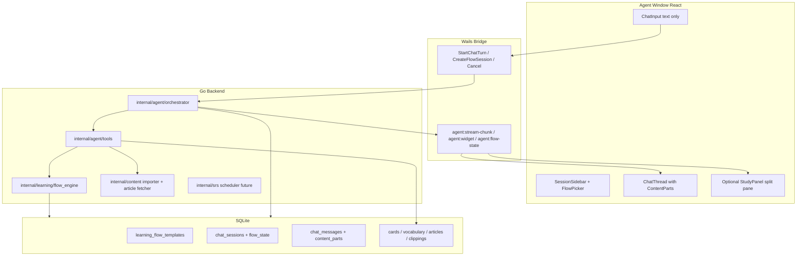
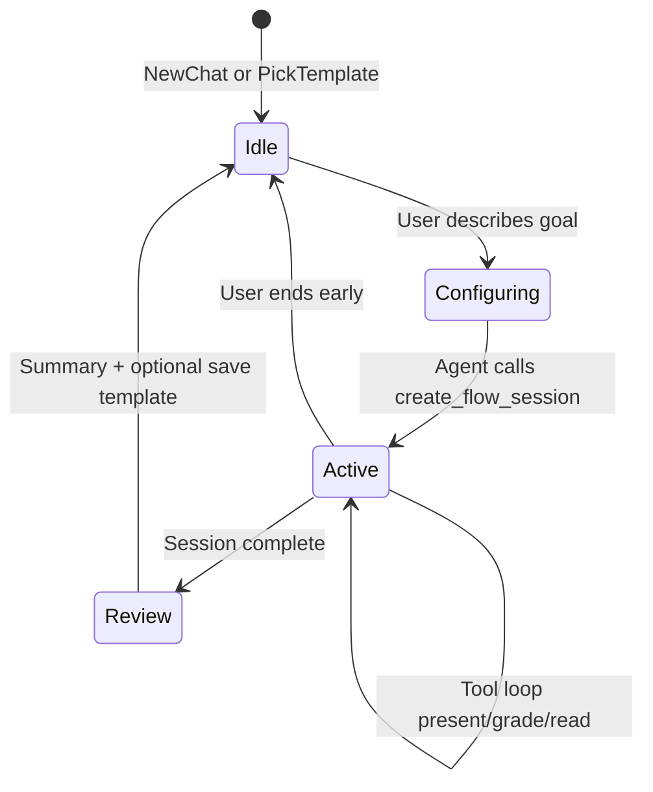
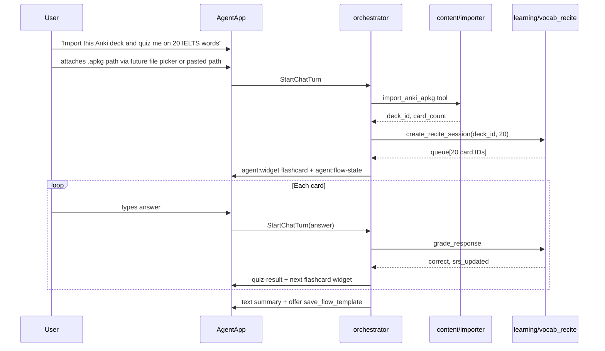
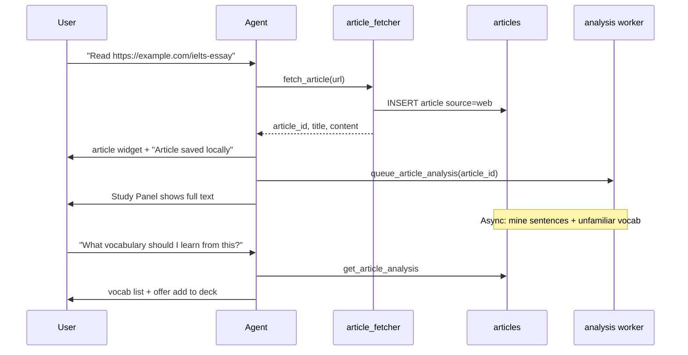

# English Learning — Agent Flows

> **Project:** Talus Echo (Talus Mofish)  
> **Domain:** English Learning (`english.*`)  
> **Stack:** Wails v3 / Go / React + Mantine / SQLite  
> **Date:** 2026-06-29 (updated 2026-07-02)  
> **Related:** [Design & Plan](design-and-plan.md) · [Chatbox Agent Flow Plan](../.cursor/plans/chatbox_agent_flow_plan_a7ec3a59.plan.md)

This document covers **English Learning** agent flows within the broader Talus Echo agent platform. General agent behavior (sessions, streaming, config) lives in the main design doc; this plan focuses on vocab recite, article reading, IELTS drills, and related tools.

---

## Table of Contents

1. [Vision](#1-vision)
2. [Terminology](#2-terminology)
3. [Architecture Overview](#3-architecture-overview)
4. [Core Concepts](#4-core-concepts)
5. [UI Design](#5-ui-design)
6. [Backend Design](#6-backend-design)
7. [Reference Flows](#7-reference-flows)
8. [Integration with Existing Codebase](#8-integration-with-existing-codebase)
9. [Implementation Phases](#9-implementation-phases)
10. [Open Decisions](#10-open-decisions)

---

## 1. Vision

Within Talus Echo's **chat-first Agent window**, the **English Learning domain** provides written-first study flows. Users start flows by natural language ("import my Anki deck and quiz me on 20 words") or by picking a saved **Flow Template**. The agent orchestrates domain tools, emits structured UI widgets inside the chat thread, and persists learning artifacts locally in SQLite.

Other domains will add their own flow templates and tools using the same orchestration layer; English Learning is the reference implementation.

**Constraints inherited from the current app:**

- Text input only ([`frontend/src/components/agent/ChatInput.tsx`](../frontend/src/components/agent/ChatInput.tsx) — no voice/files yet)
- Go-side orchestration + Wails events for streaming ([`internal/agent/orchestrator.go`](../internal/agent/orchestrator.go))
- Existing domain data: SRS cards/decks, vocabulary, articles, Anki import ([`internal/database/schema.sql`](../internal/database/schema.sql))

**Builds on (partially implemented):** [Chatbox Agent Flow Plan](../.cursor/plans/chatbox_agent_flow_plan_a7ec3a59.plan.md) — streaming shell exists; tool loop and `contentParts` are the next layer.

---

## 2. Terminology

| Term | Meaning in this plan |
|------|---------------------|
| **Learning Flow** | User-facing learning session type (vocab recite, article read, IELTS writing drill) |
| **Flow Template / Skill** | Saved, reusable flow definition the user can re-run (distinct from Cursor IDE skills in `.cursor/skills/`) |
| **Flow State** | Per-session runtime state (current card index, active article ID, score) |
| **Content Part** | Structured message segment rendered as text, widget, or tool-call UI |

LibreLingo-style curriculum `skills` from [design-and-plan.md](design-and-plan.md) remain a separate future module; Learning Flows can *reference* imported decks/articles without requiring the full course hierarchy first.

---

## 3. Architecture Overview



**Recommended layout:** **Hybrid UI** — simple tutor replies stay inline in bubbles; when a flow enters "active study" mode (flashcard drill, article reading), a **Study Panel** opens beside the thread showing the current card/article while chat handles instructions, grading feedback, and follow-up questions.

---

## 4. Core Concepts

### 4.1 Learning Flow Template (user-created "skill")

A template is a JSON/YAML document stored in SQLite describing:

```yaml
id: vocab-recite-ielts
title: "IELTS Vocabulary Recitation"
description: "Typed recall drill from a deck"
flow_type: vocab_recite
system_prompt_addendum: |
  You are running a written vocabulary test. Present one card at a time.
  Accept typed English answers. Grade generously for spelling variants.
tools: [list_decks, create_recite_session, present_card, grade_response, lookup_vocabulary]
default_config:
  deck_filter: { level: ielts }
  card_count: 20
  grading: typed_recall
ui_mode: study_panel
```

**Creation paths:**

1. **Conversational** — user describes intent; agent calls `save_flow_template` after setup
2. **Explicit** — "Save this session as a reusable flow"
3. **Built-in starters** — ship templates for IELTS vocab recite, article reading, sentence mining

Default assumption: **both session-only and reusable templates** — agent configures ad-hoc sessions, with opt-in save.

### 4.2 Flow Session Lifecycle



Each `chat_sessions` row gains flow metadata; runtime state lives in `flow_state` JSON (card queue IDs, cursor, article_id, stats).

### 4.3 Written-First Interaction Model

Since input is text-only, map oral-style exercises to written equivalents:

| Oral pattern | Written chat equivalent |
|--------------|-------------------------|
| Recite word aloud | Type the English word/definition |
| Listen and repeat | Deferred (Listening module); not in v1 chat flows |
| Read article aloud | Read in Study Panel; ask comprehension questions via chat |
| Speaking practice | IELTS Writing Task 2 draft + agent feedback on text |
| MCQ | User types A/B/C/D or clicks inline option buttons |

---

## 5. UI Design

### 5.1 Session sidebar extensions

File: [`frontend/src/components/agent/SessionSidebar.tsx`](../frontend/src/components/agent/SessionSidebar.tsx)

- **"New flow"** dropdown: General tutor | Vocab recite | Read article | Custom template
- Flow badge on session rows (icon + `flow_type`)
- Pin behavior unchanged ([`pinnedSessions.ts`](../frontend/src/components/agent/pinnedSessions.ts))

### 5.2 Content Parts model

File: [`frontend/src/components/agent/ChatThread.tsx`](../frontend/src/components/agent/ChatThread.tsx)

Evolve `ChatMessageItem` from flat `content: string` to:

```typescript
type ContentPart =
  | { type: 'text'; text: string }
  | { type: 'tool-call'; toolName: string; state: 'pending' | 'done' | 'error'; args?: unknown; result?: unknown }
  | { type: 'flashcard'; cardId: string; front: string; mode: 'prompt' | 'revealed' }
  | { type: 'article'; articleId: string; title: string; excerpt: string }
  | { type: 'progress'; current: number; total: number; label: string }
  | { type: 'quiz-result'; correct: boolean; expected: string; userAnswer: string };
```

[`MessageBubble.tsx`](../frontend/src/components/agent/MessageBubble.tsx) renders parts; reuse [`FlipCard`](../frontend/src/components/FlipCard/FlipCard.tsx) for flashcard display.

### 5.3 Study Panel

New file: `frontend/src/components/agent/StudyPanel.tsx`

| Flow type | Panel content |
|-----------|---------------|
| `vocab_recite` | Large FlipCard front; answer revealed after grading |
| `article_read` | Scrollable article body (markdown); future: text selection → clipping |
| `general` | Hidden (chat-only) |

Panel syncs via `agent:flow-state` and `agent:widget` events, not only message reload.

### 5.4 ChatInput behavior during active flows

- Placeholder changes by flow ("Type your answer…" vs "Ask about this paragraph…")
- Optional quick actions above input: `Skip`, `Reveal hint`, `End session`
- Enter sends answer; agent tool `grade_response` evaluates before next card

---

## 6. Backend Design

### 6.1 Database schema additions

Extend [`internal/database/schema.sql`](../internal/database/schema.sql):

```sql
-- Reusable flow templates (user-created "skills")
CREATE TABLE learning_flow_templates (
    id TEXT PRIMARY KEY,
    title TEXT NOT NULL,
    description TEXT NOT NULL DEFAULT '',
    flow_type TEXT NOT NULL CHECK (flow_type IN (
        'general', 'vocab_recite', 'article_read', 'sentence_mine', 'ielts_writing'
    )),
    config_json TEXT NOT NULL DEFAULT '{}',
    system_prompt_addendum TEXT NOT NULL DEFAULT '',
    created_at TEXT NOT NULL DEFAULT (datetime('now')),
    updated_at TEXT NOT NULL DEFAULT (datetime('now'))
);

-- Extend chat_sessions
ALTER TABLE chat_sessions ADD COLUMN flow_type TEXT NOT NULL DEFAULT 'general';
ALTER TABLE chat_sessions ADD COLUMN flow_template_id TEXT REFERENCES learning_flow_templates(id);
ALTER TABLE chat_sessions ADD COLUMN flow_state_json TEXT NOT NULL DEFAULT '{}';

-- Extend chat_messages for structured rendering
ALTER TABLE chat_messages ADD COLUMN content_parts_json TEXT;
ALTER TABLE chat_messages ADD COLUMN finish_reason TEXT;

-- Article analysis (deferred enrichment)
CREATE TABLE article_analysis (
    id TEXT PRIMARY KEY,
    article_id TEXT NOT NULL REFERENCES articles(id) ON DELETE CASCADE,
    status TEXT NOT NULL DEFAULT 'pending' CHECK (status IN ('pending','processing','done','failed')),
    well_written_sentences_json TEXT NOT NULL DEFAULT '[]',
    unfamiliar_vocab_json TEXT NOT NULL DEFAULT '[]',
    summary TEXT NOT NULL DEFAULT '',
    analyzed_at TEXT,
    error_message TEXT NOT NULL DEFAULT ''
);

CREATE INDEX idx_article_analysis_article ON article_analysis(article_id);
```

Use a migration runner (existing pattern in [`internal/database/`](../internal/database/)) rather than raw ALTER in production.

### 6.2 Flow engine (`internal/learning/`)

| File | Role |
|------|------|
| `flow_engine.go` | Create/resume/end sessions; read/write `flow_state_json` |
| `vocab_recite.go` | Card queue from deck; present/grade/advance |
| `article_read.go` | Bind article to session; trigger analysis job |
| `types.go` | `FlowState`, `ReciteState`, `ArticleReadState` |

Reuses existing store queries: [`db/queries/srs.sql`](../db/queries/srs.sql), [`db/queries/articles.sql`](../db/queries/articles.sql), [`internal/content/importer.go`](../internal/content/importer.go).

### 6.3 Agent tools (`internal/agent/tools/`)

Implement after extending orchestrator with tool-call loop (Phase B of chatbox plan).

**Flow management**

| Tool | Purpose |
|------|---------|
| `create_flow_session` | Set `flow_type`, init `flow_state`, switch UI mode |
| `save_flow_template` | Persist reusable skill from current session config |
| `list_flow_templates` | List user's saved flows |

**Vocabulary / Anki**

| Tool | Purpose |
|------|---------|
| `list_decks` | Query SRS decks (including Anki-imported) |
| `import_anki_apkg` | Wrap [`ImportAnkiAPKG`](../internal/appservice/import.go) — agent guides mapping via chat |
| `create_recite_session` | Build card queue: `{ deck_id, count, filter_level? }` |
| `present_card` | Emit flashcard widget + update flow state |
| `grade_response` | Compare typed answer; update SRS via `review_log`; emit quiz-result part |
| `lookup_vocabulary` | Search vocabulary table |
| `explain_word` | AI explanation with user level from config |

**Article reading**

| Tool | Purpose |
|------|---------|
| `fetch_article` | HTTP GET + readability extraction → insert `articles` (`source='web'`) |
| `bind_article_to_session` | Link article to flow; emit article widget |
| `queue_article_analysis` | Insert `article_analysis` row; background job |
| `get_article_analysis` | Return mined sentences/vocab when `status='done'` |
| `save_clipping` | Insert `clippings` row; optional `save_to_deck` |

**Tool assembly** (`internal/agent/tools_builder.go` — new): gate tools by `session.flow_type` + model capabilities, mirroring Chatbox's conditional assembly.

### 6.4 Streaming pattern extensions

Current events ([`internal/agent/events.go`](../internal/agent/events.go)):

| Event | Payload | When |
|-------|---------|------|
| `agent:stream-chunk` | `{ sessionId, messageId, chunk }` | text-delta, tool-call, tool-result |
| `agent:widget` | `{ sessionId, messageId, part }` | Structured UI part (flashcard, article, progress) |
| `agent:flow-state` | `{ sessionId, flowType, state }` | Study Panel sync |
| `agent:turn-done` | existing | Turn complete |
| `agent:turn-error` / `agent:turn-cancelled` | existing | Error/cancel |

Orchestrator changes in [`internal/agent/orchestrator.go`](../internal/agent/orchestrator.go):

1. Tool-call loop (max ~10 iterations per user message)
2. `stream_processor.go` folds chunks into `content_parts_json`
3. Tools emit widgets via emitter before/after text response
4. Debounced persist (~2s) writes both `content` (plain-text fallback) and `content_parts_json`

Context builder ([`internal/agent/context.go`](../internal/agent/context.go)) injects:

- Flow template system prompt addendum
- Serialized `flow_state` summary (current card, article title)
- User config: `dailyGoalMinutes`, `wordsPerSession`, IELTS level preference
- Token-budgeted vocab stats (due card count)

### 6.5 Article fetch pipeline

New file: `internal/content/article_fetcher.go`

1. Validate URL; fetch with timeout + size limit
2. Extract main content (recommend [go-readability](https://github.com/go-shiori/go-readability) or similar)
3. Strip scripts/ads; compute `word_count`
4. Store in `articles` — **local-first**, URL as metadata
5. Return `{ article_id, title, excerpt }` to agent

Analysis job (async goroutine, not blocking chat turn):

- Sentence segmentation + LLM pass for "well-written" candidates
- Cross-reference words against user's `vocabulary` + deck contents for "unfamiliar"
- Write `article_analysis`; emit optional `agent:flow-state` when complete

---

## 7. Reference Flows

### 7.1 Anki import → vocabulary recitation test



**UI notes:** Reuse ImportPage mapping logic ([`ImportPage.tsx`](../frontend/src/pages/ImportPage.tsx)) — agent can either invoke the same Go importer or open Management window for complex field mapping. For v1, agent calls existing `PreviewAnkiAPKG` + `ImportAnkiAPKG` bindings with user-confirmed mapping stored in flow state.

**SRS:** Wire `grade_response` to existing [`UpdateCardSRS`](../db/queries/srs.sql) / `CreateReviewLog`. SM-2 scheduler in `internal/srs/` can land in parallel (currently DB-only).

### 7.2 Article link → read locally → future analysis



**Future analysis outputs** (stored in `article_analysis`):

- `well_written_sentences_json`: `[{ text, reason, cefr_level }]`
- `unfamiliar_vocab_json`: `[{ word, context_sentence, in_user_deck: bool }]`
- Enables follow-up chat: "Explain sentence 3", "Add these 5 words to my IELTS deck"

---

## 8. Integration with Existing Codebase

| Existing asset | How Learning Flows use it |
|----------------|---------------------------|
| [`internal/content/importer.go`](../internal/content/importer.go) | Anki → decks/cards/vocabulary |
| [`articles`](../internal/database/schema.sql) + [`ReadingPage`](../frontend/src/pages/ReadingPage.tsx) | Shared article store; Management window remains library view |
| [`FlipCard`](../frontend/src/components/FlipCard/FlipCard.tsx) | Study Panel + inline flashcard parts |
| [`clippings`](../internal/database/schema.sql) | User selections during article flow |
| [`internal/config/config.go`](../internal/config/config.go) | `wordsPerSession`, AI provider |
| Agent/Management windows | Cross-window events: `article:created`, `vocab:updated` for Management refresh |

Chat remains in Agent window; Management stays the **library admin** surface. Flows bridge both via shared SQLite.

---

## 9. Implementation Phases

### Phase 1 — Foundation (tool loop + content parts)

- Add DB migrations for `content_parts_json`, session flow columns
- Implement tool-call loop in orchestrator + `stream_processor.go`
- Frontend: render text + tool-call parts; markdown for assistant text
- Extend `BuildMessages` with flow-aware system prompt

**Key files:** [`internal/agent/orchestrator.go`](../internal/agent/orchestrator.go), [`frontend/src/hooks/useAgentStream.ts`](../frontend/src/hooks/useAgentStream.ts), [`db/queries/chat.sql`](../db/queries/chat.sql)

### Phase 2 — Vocab recite flow

- `internal/learning/vocab_recite.go` + tools: `create_recite_session`, `present_card`, `grade_response`
- Study Panel + flashcard/quiz-result content parts
- End-of-session summary; optional `save_flow_template`
- Wire SRS rating to `review_log`

### Phase 3 — Article read flow

- `internal/content/article_fetcher.go`
- Tools: `fetch_article`, `bind_article_to_session`
- Study Panel article reader (markdown render)
- Background `article_analysis` worker + `get_article_analysis` tool

### Phase 4 — User skill library + IELTS templates

- `learning_flow_templates` CRUD + Flow Picker UI
- Built-in templates: IELTS vocab recite, article comprehension, sentence mining
- `import_anki_apkg` tool with conversational mapping assist

### Phase 5 — Polish

- Cross-window events for Management sync
- Flow resume (reload `flow_state` on session select)
- Cost controls: batch analysis, cache AI explanations on clippings
- IELTS Writing flow (`ielts_writing` type) — typed essay + rubric feedback

---

## 10. Open Decisions

| Decision | Recommendation | Alternative |
|----------|----------------|-------------|
| Skill persistence | Both ad-hoc + save-as-template | Session-only |
| Chat layout | Hybrid inline + Study Panel | Inline-only |
| Anki import in chat | Agent calls Go importer; complex mapping opens Management | Full import UI embedded in chat |
| Analysis timing | Async background job | Inline during first turn (slow) |
| Curriculum skills (LibreLingo) | Defer; flows reference decks/articles directly | Unify into one skill model |
