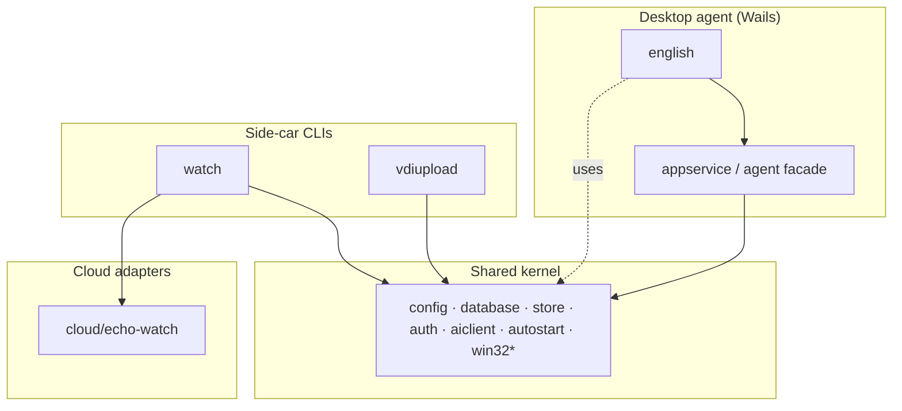

# Domain map (DDD layout)

Talus Echo is a **multi-domain monorepo**. Bounded contexts are owned packages; a thin **shared kernel** stays under flat `internal/` packages that domains may depend on — never the reverse.

## Before → after

| Concern | Before | After |
|---------|--------|-------|
| Domain IDs | `internal/domain` (English only) | `internal/domain` catalogs `english`, `watch`, `vdiupload` |
| English Learning | Spread across `content/`, `store/`, `appservice/` (undocumented as a BC) | Documented BC; physical consolidation deferred |
| Echo Watch | `internal/watch` + `cmd/echo-watch` + `cloud/echo-watch` (ad-hoc) | Same paths; owned as BC `watch` with docs under `docs/domains/watch/` |
| VDI upload | — | New BC: `internal/vdiupload`, `cmd/vdi-upload`, design in `docs/domains/vdiupload/` |
| Shared kernel | Implicit (appservice, agent, db, auth, …) | Explicit: see [Shared kernel](#shared-kernel); must not import domain packages |
| Design docs | Flat `docs/*.md` | Domain docs under `docs/domains/<id>/`; platform docs stay in `docs/` |

## Bounded contexts

\* `win32` helpers are a planned extract from `watch` / `vdiupload` (see migration).

| Domain | Kind | Code | Docs |
|--------|------|------|------|
| [english](./english/) | desktop-agent | `internal/content`, `internal/store`, appservice english APIs | [README](./english/README.md), [design-and-plan](../design-and-plan.md) |
| [watch](./watch/) | sidecar | `internal/watch`, `cmd/echo-watch`, `cloud/echo-watch` | [README](./watch/README.md) |
| [vdiupload](./vdiupload/) | sidecar | `internal/vdiupload`, `cmd/vdi-upload` | [DESIGN.md](./vdiupload/DESIGN.md) |

## Shared kernel

Packages that multiple domains may use. **Rule:** kernel packages must not import `internal/watch`, `internal/vdiupload`, or future domain roots.

| Package | Role |
|---------|------|
| `internal/appservice` | Wails application service / API facade |
| `internal/agent`, `internal/aiclient` | Chat orchestration + LLM client |
| `internal/auth`, `internal/config`, `internal/autostart` | Identity, settings, OS login items |
| `internal/database`, `internal/store` | SQLite + sqlc |
| `internal/content` | Content importers (today English-owned; treat as domain until split) |
| `internal/httputil`, `internal/debuglog` | Cross-cutting utilities |
| `internal/domain` | Domain catalog only (no business logic) |

Planned shared extract (not yet moved):

| Package | Role |
|---------|------|
| `internal/platform/win32` | Window enum, focus, clipboard, SendInput — shared by watch + vdiupload |

## Dependency rules

1. **Domain → kernel** OK; **kernel → domain** forbidden.
2. **Domain → domain** forbidden (no `watch` importing `vdiupload` or vice versa). Share via kernel or events/config only.
3. **Delivery adapters** (`cmd/*`, `cloud/*`, Wails root) may wire domains; domains must not import `cmd/` or `main`.
4. Windows-only code stays behind `//go:build windows` (and stubs elsewhere), matching `watch` today.

## Remaining migration steps

1. Gradually move English-specific appservice methods behind `internal/english` application services; keep Wails bindings stable.
2. Extract duplicated Win32 window/process helpers from `internal/watch` into `internal/platform/win32` once `vdiupload` needs the same APIs.
3. Optionally relocate `internal/content` under `internal/english/content` when import churn is acceptable.
4. Keep `cloud/echo-watch` co-located with the watch delivery story (do not nest under `internal/`).

## Task / build entry points

| Task | Domain |
|------|--------|
| `wails3 dev` / `task build` | english + platform |
| `task watch:build` / `watch:run` / `watch:deploy` | watch |
| `task vdiupload:build` / `vdiupload:run` | vdiupload |
