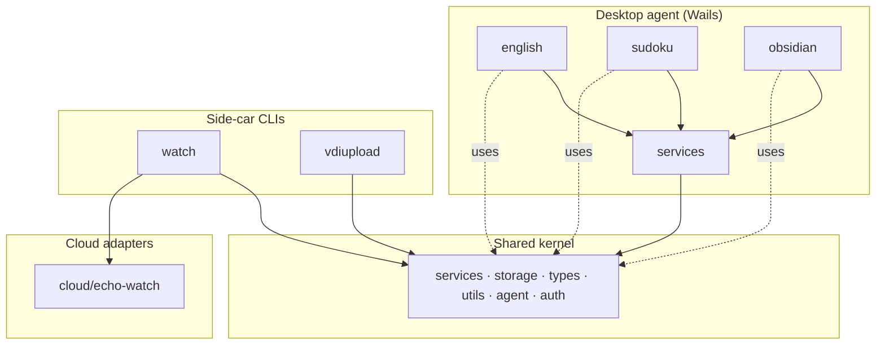

# Domain map (DDD layout)

Talus Echo is a **multi-domain monorepo**. Bounded contexts are owned packages under `backend/`; a thin **shared kernel** (`backend/services`, `backend/storage`, `backend/types`, `backend/utils`, `backend/agent`, `backend/auth`) may be used by domains — never the reverse.

## Backend layout (Tiny RDM-style)

```
backend/
├── services/     # Wails-bound facades (System, Config, Auth, Chat, English, Sudoku, Obsidian)
├── storage/      # SQLite + config.json + sqlc store
├── types/        # Shared Wails/JSON DTOs
├── utils/        # aiclient, autostart, env loader
├── consts/       # Domain IDs and constants
├── agent/        # Chat orchestration kernel
├── auth/         # Identity kernel
├── english/      # English Learning domain (content importers)
├── sudoku/       # YouDoSudoku Agent window games
├── obsidian/     # Obsidian Local REST API vault client
├── watch/        # Echo Watch sidecar domain
└── vdiupload/    # VDI upload sidecar domain
```

## Bounded contexts



| Domain | Kind | Code | Docs |
|--------|------|------|------|
| [english](./english/) | desktop-agent | `backend/english/content`, `backend/storage/store`, `backend/services/english` | [README](./english/README.md), [design-and-plan](../design-and-plan.md) |
| [sudoku](./sudoku/) | desktop-agent | `backend/sudoku`, `backend/services/sudoku.go`, `backend/storage` | [README](./sudoku/README.md) |
| [obsidian](./obsidian/) | desktop-agent | `backend/obsidian`, `backend/services/obsidian.go` | [README](./obsidian/README.md) |
| [watch](./watch/) | sidecar | `backend/watch`, `cmd/echo-watch`, `cloud/echo-watch` | [README](./watch/README.md) |
| [vdiupload](./vdiupload/) | sidecar | `backend/vdiupload`, `cmd/vdi-upload` | [DESIGN.md](./vdiupload/DESIGN.md) |

## Shared kernel

Packages that multiple domains may use. **Rule:** kernel packages must not import `backend/watch`, `backend/vdiupload`, `backend/english`, or `backend/obsidian`.

| Package | Role |
|---------|------|
| `backend/services` | Wails API facades |
| `backend/agent`, `backend/utils/aiclient` | Chat orchestration + LLM client |
| `backend/auth`, `backend/storage`, `backend/utils/autostart` | Identity, persistence, OS login items |
| `backend/storage/store` | sqlc-generated SQLite access |
| `backend/types` | Shared DTOs for Wails bindings |
| `backend/consts` | Domain catalog and constants |

Planned shared extract (not yet moved):

| Package | Role |
|---------|------|
| `backend/platform/win32` | Window enum, focus, clipboard, SendInput — shared by watch + vdiupload |

## Dependency rules

1. **Domain → kernel** OK; **kernel → domain** forbidden.
2. **Domain → domain** forbidden (no `watch` importing `vdiupload` or vice versa). Share via kernel or events/config only.
3. **Delivery adapters** (`cmd/*`, `cloud/*`, Wails root) may wire domains; domains must not import `cmd/` or `main`.
4. Windows-only code stays behind `//go:build windows` (and stubs elsewhere), matching `watch` today.

## Remaining migration steps

1. Extract duplicated Win32 window/process helpers from `backend/watch` into `backend/platform/win32` once `vdiupload` needs the same APIs.
2. Keep `cloud/echo-watch` co-located with the watch delivery story (do not nest under `backend/`).

## Task / build entry points

| Task | Domain |
|------|--------|
| `wails3 dev` / `task build` | english + platform |
| `task watch:build` / `watch:run` / `watch:deploy` | watch |
| `task vdiupload:build` / `vdiupload:run` | vdiupload |
