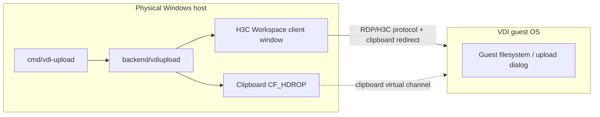
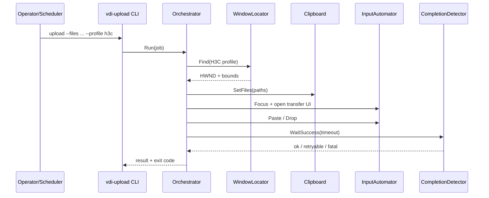
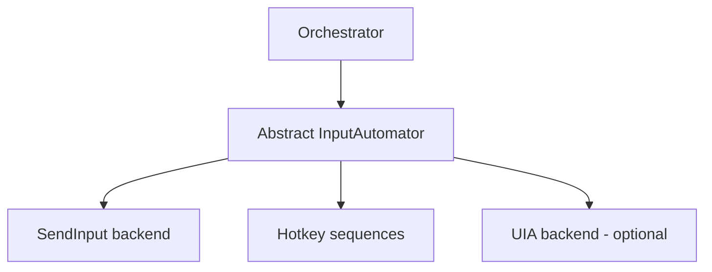
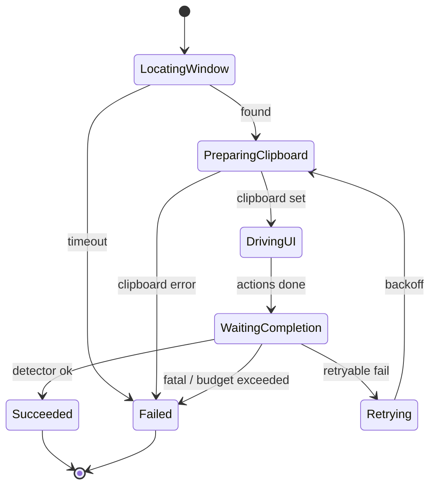
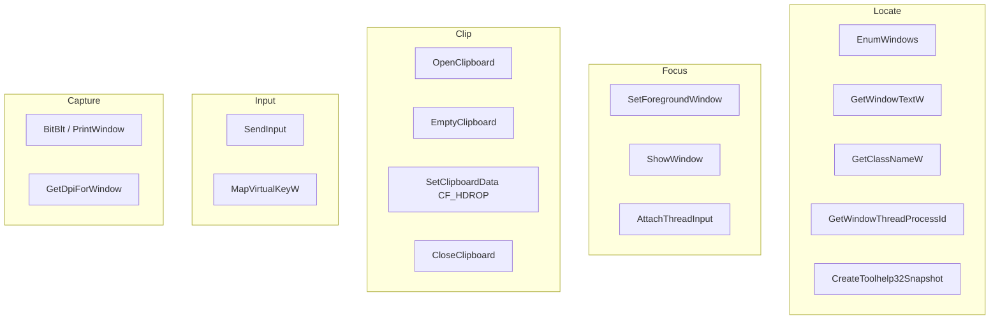
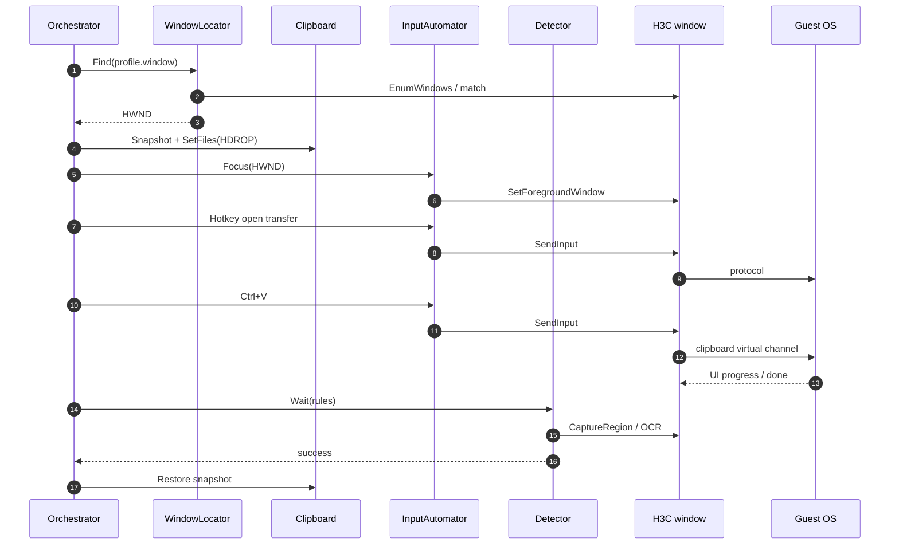
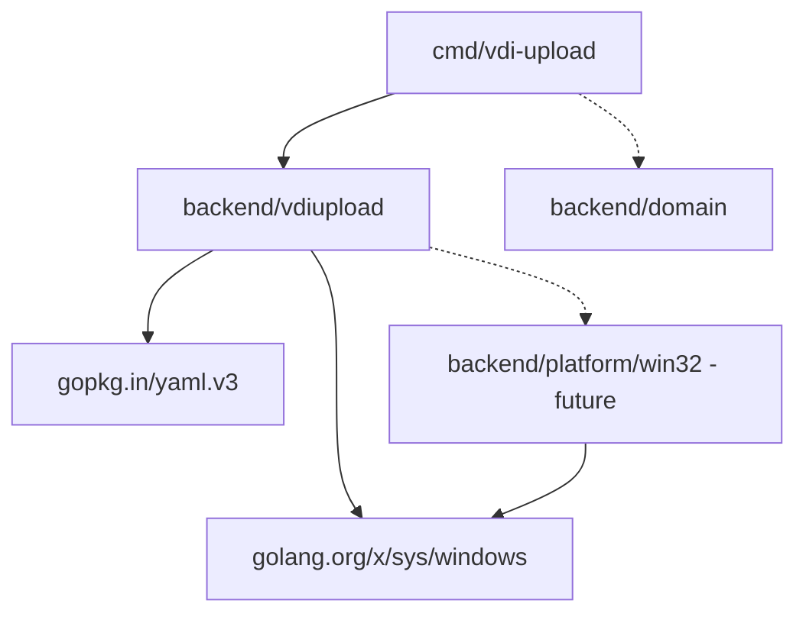
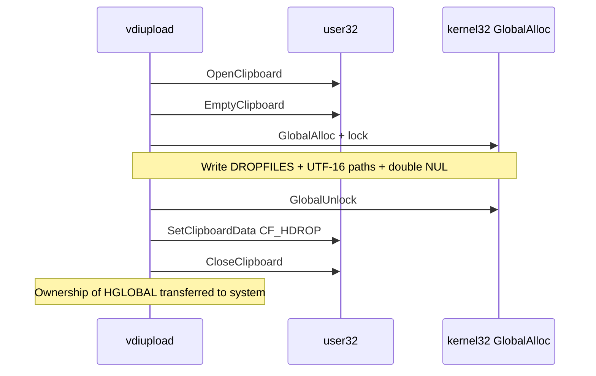

# VDI File Upload — Engineering Design (H3C Workspace)

> **Domain ID:** `vdiupload`  
> **Audience:** experienced Go backend engineers with limited Win32 UI-automation experience  
> **Status:** Design + scaffold (implementation phased)  
> **Code roots:** `backend/vdiupload`, `cmd/vdi-upload`  
> **Related:** [Domain map](../README.md), [Echo Watch](../watch/README.md)

---

## Desired output summary

| # | Deliverable | Location in this doc |
|---|-------------|----------------------|
| 1 | Executive summary | §0 |
| 2 | Architecture diagrams (mermaid) | §1, §8, appendix diagrams |
| 3 | Phased implementation roadmap | §14 |
| 4 | Risks and mitigations | §15 |
| 5 | Recommended Go packages (minimal) | §16 |
| 6 | Performance considerations | §17 |
| 7 | Security considerations | §18 |
| 8 | Testing plan | §12 + §19 |
| 9 | Future VDI platforms | §13 |
| 10–13 | Package layout, concurrency, logging, config | §7–§11 |

---

## 0. Executive summary

**Problem.** H3C Workspace (and similar VDI clients) often block or complicate host→guest file copy. Operators need a reliable, unattended way to push local files into the remote desktop session without manually driving the UI every time.

**Approach.** A Windows side-car Go CLI (`vdi-upload`) running on the **physical host** (same trust boundary as Echo Watch):

1. Resolve the H3C Workspace client window (process + title heuristics).
2. Stage the payload on the Windows clipboard as **CF_HDROP** (file drop list) and/or fallback formats.
3. Focus the client, open the guest “upload / transfer / paste” surface via SendInput / menu hotkeys (configurable per profile).
4. Paste or simulate drop into the guest UI.
5. Detect completion via OCR/pixel change, window title, or timeout + retry policy.
6. Emit structured logs and exit codes suitable for Task Scheduler / CI wrappers.

**Non-goals (v1).** In-guest agents, kernel drivers, modifying H3C binaries, cross-OS hosts, tight coupling to the Wails English Learning app.

**Relationship to Echo Watch.** Both automate against the **local VDI client window**. Watch is **read-only** (capture/OCR/alert). Upload is **write** (clipboard + input). Share Win32 primitives later via `backend/platform/win32`; keep domains independent.

---

## 1. System architecture

### 1.1 High-level architecture



### 1.2 Component interaction



### 1.3 Design principles

| Principle | Implication |
|-----------|-------------|
| Host-only | Never install code inside the guest for v1 |
| Profile-driven | H3C-specific selectors live in YAML profiles, not hard-coded Go |
| Idempotent jobs | Same file set + destination key → safe to retry |
| Fail loud | Distinguish config errors, window-not-found, clipboard failure, timeout |
| Thin Win32 surface | Isolate syscall wrappers; business flow stays testable with fakes |
| Domain isolation | No imports from `backend/watch`; shared code → platform kernel later |

### 1.4 Trade-offs

| Option | Pros | Cons | Decision |
|--------|------|------|----------|
| Clipboard file list (CF_HDROP) | Uses existing VDI clipboard channel; no custom protocol | Depends on H3C clipboard redirect; size limits; race with user clipboard | **Primary v1 path** |
| Simulated drag-drop into client | Mimics human UX | Fragile coordinates; DPI/scaling hell | Optional secondary |
| In-guest agent + HTTP | Robust | Requires guest install + network path; out of scope | Future |
| UI Automation (UIA) COM | Stable control IDs when available | H3C may expose few UIA nodes; COM complexity in Go | Probe in Phase 1 spike |
| OCR-only navigation | Works without UIA | Slow, flaky, language-dependent | Completion + fallback only |

---

## 2. Clipboard strategy

### 2.1 Preferred format: `CF_HDROP`

Windows shell file transfer on clipboard uses the **HDROP** format (`CF_HDROP`): a `DROPFILES` structure followed by a double-null-terminated list of absolute paths (Unicode).

**Why this fits VDI:** Most remote-desktop stacks redirect clipboard; when the guest receives HDROP, the remote shell can materialize files via the virtual channel (behavior product-specific).

### 2.2 Sequence (host)

1. `OpenClipboard` → `EmptyClipboard`.
2. Allocate global memory with `DROPFILES` + path list (`fWide = 1`).
3. `SetClipboardData(CF_HDROP, hMem)`.
4. Optionally also set `CF_UNICODETEXT` with a path list for paste-into-path-field fallbacks (profile flag).
5. `CloseClipboard`.
6. After paste completes (or on failure), optionally **restore** previous clipboard snapshot (best-effort; see security).

### 2.3 Constraints and mitigations

| Constraint | Mitigation |
|------------|------------|
| Clipboard is global / single-owner | Serialize all upload jobs on one mutex; refuse concurrent CLI instances via named mutex |
| User may overwrite clipboard mid-job | Hold clipboard ownership window short; detect mismatch before paste |
| Path must be absolute and accessible | Resolve + `os.Stat` before set; reject network paths if profile forbids |
| Large files / many files | Profile `max_files`, `max_total_bytes`; split into batches |
| H3C may disable clipboard redirect | Preflight check: document operator setting; fail with actionable error |
| Unicode paths | Always use wide (UTF-16) HDROP |

### 2.4 Fallbacks (profile-ordered)

1. **HDROP paste** into focused guest window (`Ctrl+V`).
2. **Path text paste** into an “upload path” edit box (if H3C exposes one).
3. **Open host file dialog** automation (last resort; coordinate/UIA fragile).

---

## 3. Window detection

### 3.1 Goals

Find the correct top-level HWND for the H3C Workspace **session client** (not installer, not tray balloon, not a buried dialog unless profile says so).

### 3.2 Matching strategy (ordered)

1. **Process name** allow-list (e.g. `H3CWorkspace.exe`, exact names from spike).
2. **Window title regex** (session name, “Workspace”, server alias).
3. **Class name** if stable (`GetClassNameW`) — spike to confirm.
4. **Visibility / iconic filters** — prefer visible, non-minimized (optionally restore).
5. **Z-order / largest area** tie-break among matches.
6. Optional **child dialog** search for “Upload” / “文件传输” titles after main window focused.

Reuse patterns already proven in `backend/watch` (`EnumWindows`, PID → exe via Toolhelp snapshot, title regex).

### 3.3 Failure modes

| Condition | Behavior |
|-----------|----------|
| No match | Exit `window_not_found` (retryable if `--wait-window`) |
| Multiple matches | Prefer largest visible; or require unique title; config `strict_unique: true` |
| Minimized | `ShowWindow(SW_RESTORE)` then re-validate |
| DPI / multi-monitor | Store bounds in physical pixels; document Per-Monitor v2 awareness |

### 3.4 Spike checklist (Phase 0)

- [ ] Record real process names and titles for connected vs disconnected states  
- [ ] Confirm whether transfer UI is top-level or owned dialog  
- [ ] Check UIA tree for upload controls  
- [ ] Confirm clipboard redirect setting name in H3C client  

---

## 4. Input automation

### 4.1 Layers



### 4.2 Focus

1. `SetForegroundWindow` (may fail under Windows focus-stealing mitigations).
2. Fallback: `AttachThreadInput` + `BringWindowToTop` + `SetForegroundWindow`.
3. Fallback: brief `Alt` key via SendInput then retry (common trick; use sparingly).
4. Verify with `GetForegroundWindow == target`.

### 4.3 Action vocabulary (profile script)

Profiles express a small DSL of steps, not raw Go:

| Step | Meaning |
|------|---------|
| `focus` | Foreground target HWND |
| `keys: "^t"` | SendInput chord (syntax TBD; prefer explicit list) |
| `keys: ["ctrl", "v"]` | Paste |
| `wait_ms: 500` | Fixed delay |
| `wait_ocr: { any_text: ["上传成功", "Upload complete"] }` | Poll detector |
| `click_rel: { x: 0.5, y: 0.2 }` | Relative-to-client click (discouraged) |

### 4.4 SendInput guidelines

- Prefer **scan codes** + extended key flags for layout independence where possible.
- Insert small delays between chords (profile `key_delay_ms`).
- Never leave modifier keys stuck: track and force-keyup in `defer`.
- Disable input during screen lock / UAC (detect and abort).

### 4.5 Why not always click coordinates?

VDI client chrome scales with DPI, resolution, and local window size. Clipboard paste after a **keyboard-only** “open transfer panel” hotkey is far more portable when H3C provides one.

---

## 5. Completion detection

### 5.1 Signals (compose with OR / AND in profile)

| Signal | Mechanism | Reliability |
|--------|-----------|-------------|
| OCR text match | BitBlt client region + OCR (reuse watch capturer patterns) | Medium; language packs |
| Pixel hash change then settle | HashGate-style (see `backend/watch`) | Medium |
| Dialog close | Enum child windows; expected dialog gone | High if dialog exists |
| Clipboard cleared by guest | Observational only; weak | Low |
| Timeout | Absolute deadline | Always as backstop |

### 5.2 State machine



### 5.3 Success criteria (v1 recommendation)

Treat success as: **detector rule matched within timeout** AND **no error dialog OCR** (`any_text` deny-list: “失败”, “error”, “denied”).

Do **not** assume guest path listing without a confirmed UI signal — false positives are worse than retries.

---

## 6. Error recovery

### 6.1 Error taxonomy

| Code | Retryable | Typical cause |
|------|-----------|---------------|
| `config_invalid` | no | Bad YAML / missing files |
| `window_not_found` | yes | Client not running / wrong title |
| `focus_failed` | yes | OS focus rules / secure desktop |
| `clipboard_failed` | yes | Another app holding clipboard |
| `input_failed` | yes | Stuck modifiers / rejected SendInput |
| `completion_timeout` | yes | Slow transfer / wrong detector |
| `completion_negative` | maybe | Explicit error UI seen |
| `cancelled` | no | Context cancel |
| `unsupported_os` | no | Non-Windows build |

### 6.2 Retry policy

- Exponential backoff with jitter: `base=1s`, `max=30s`, `attempts` from profile (default 3).
- Re-resolve HWND each attempt (window may have been recreated).
- Re-set clipboard each attempt.
- Circuit breaker: after N consecutive `focus_failed`, abort and ask operator to interact once.

### 6.3 Compensating actions

- Restore clipboard snapshot on exit (best effort).
- Release foreground if we stole focus (optional).
- Clear stuck modifiers.
- Write a failure artifact path list for manual resume.

---

## 7. Go application design

### 7.1 Package layout

```
cmd/vdi-upload/
  main.go                 # flags, logging setup, exit codes
  automator_windows.go    # wire real Win32 backends
  automator_stub.go       # non-Windows: clear error

backend/vdiupload/
  doc.go                  # domain package docs
  config.go               # YAML profile + job config
  types.go                # Job, Result, ErrorCode
  orchestrator.go         # state machine
  window.go               # WindowLocator interface
  window_windows.go       # EnumWindows implementation
  window_stub.go
  clipboard.go            # Clipboard interface
  clipboard_windows.go    # CF_HDROP
  clipboard_stub.go
  input.go                # InputAutomator interface
  input_windows.go        # SendInput
  input_stub.go
  detect.go               # CompletionDetector interface
  detect_ocr.go           # optional OCR-backed detector
  logging.go              # slog helpers / correlation id
  config_example.yaml
```

### 7.2 Core types (sketch)

```go
type Job struct {
    Files      []string
    Profile    string // e.g. "h3c-workspace"
    DestHint   string // optional label for logs
    Timeout    time.Duration
    DryRun     bool
}

type Result struct {
    Code      ErrorCode
    Attempts  int
    Duration  time.Duration
    Message   string
    Window    string
}
```

### 7.3 Ports (interfaces)

| Port | Methods (conceptual) |
|------|----------------------|
| `WindowLocator` | `Find(ctx, match) (Window, error)` |
| `Clipboard` | `SetFiles(ctx, paths) (restore func(), error)` |
| `InputAutomator` | `Focus(ctx, w)`, `RunSteps(ctx, w, steps)` |
| `CompletionDetector` | `Wait(ctx, w, rules) error` |
| `Capturer` (optional) | Shared contract with watch later |

Orchestrator depends only on ports → unit tests with fakes on any OS.

### 7.4 CLI UX

```text
vdi-upload --config %AppData%\TalusEcho\vdi-upload.yaml \
  --profile h3c-workspace \
  --file C:\payload\a.zip --file C:\payload\b.pdf

vdi-upload --dry-run --file ...
vdi-upload --wait-window 2m --file ...
```

Exit codes: `0` success; `2` retryable; `3` fatal config; `4` unsupported OS; `130` cancelled.

### 7.5 Relation to Wails app

v1 is **standalone**. Optional later: services method “queue upload job” that shells out or imports the orchestrator — still keep domain package free of Wails types.

---

## 8. Win32 integration

### 8.1 API map



### 8.2 Implementation notes for Go engineers new to Win32

- Prefer `golang.org/x/sys/windows` + `NewLazySystemDLL` (same style as `backend/watch`).
- Keep structs **exact layout** (`DROPFILES`) with `encoding/binary` or explicit fields + `unsafe`.
- Always match `OpenClipboard` / `CloseClipboard`; use `defer`.
- Global alloc for clipboard: `GlobalAlloc(GMEM_MOVEABLE)`, `GlobalLock`/`Unlock`; ownership transfers to system on successful `SetClipboardData`.
- Test on a machine with **the real H3C client**; VMs without the client only prove stubs.

### 8.3 UAC / secure desktop

Do not attempt automation on the secure desktop (Ctrl+Alt+Del, UAC prompt). Detect via window station / failed focus and abort with `focus_failed`.

---

## 9. Concurrency model

| Concern | Approach |
|---------|----------|
| Multiple jobs | Single-flight mutex process-wide (`CreateMutex` named `Local\TalusEcho.VDIUpload`) |
| Within a job | Sequential steps; detectors may poll with ticker |
| Context | All blocking calls honor `context.Context` |
| Clipboard | Critical section covers set → paste → release |
| Watching overlap | Do not run upload paste while Echo Watch holds capture locks if shared capturer later; today separate processes — document “don’t overlap destructive UI” |

No worker pool in v1. Throughput = one transfer UI at a time (matches human reality).

---

## 10. Logging and observability

- Use `log/slog` JSON or text (flag `--log-format`).
- Fields: `job_id`, `profile`, `attempt`, `hwnd`, `files_count`, `bytes`, `error_code`, `duration_ms`.
- Avoid logging full file paths if profile `redact_paths: true` (log basename + hash instead).
- Optional `--verbose` for each SendInput chord (debug only).
- Correlation: generate UUID per invocation; print on start/end for Task Scheduler logs.

---

## 11. Configuration

### 11.1 File location

Default: `%AppData%\TalusEcho\vdi-upload.yaml` (same product config dir family as Echo Watch).

### 11.2 Schema (illustrative)

```yaml
default_profile: h3c-workspace
log_level: info
mutex_name: "Local\\TalusEcho.VDIUpload"

profiles:
  h3c-workspace:
    window:
      process_names: ["H3CWorkspace.exe"]  # confirm in spike
      title_regex: "(?i)H3C|Workspace"
      class_name: ""                        # optional
      require_visible: true
      restore_if_minimized: true
    clipboard:
      format: hdrop
      also_set_text_paths: false
      restore_previous: true
      max_files: 20
      max_total_bytes: 524288000
    steps:
      - focus
      - keys: ["ctrl", "alt", "u"]         # example — replace after spike
      - wait_ms: 800
      - keys: ["ctrl", "v"]
      - wait_ocr:
          region: { x: 0, y: 0, w: 800, h: 200 }
          any_text: ["成功", "complete"]
          deny_text: ["失败", "error"]
          timeout: 120s
    retry:
      attempts: 3
      base_delay: 1s
      max_delay: 30s
```

### 11.3 Validation

Fail fast on: empty files, missing profile, invalid regex, `max_*` violations, zero timeout, unknown step kinds.

---

## 12. Testing strategy (engineering)

| Layer | What | How |
|-------|------|-----|
| Unit | Orchestrator transitions, retry math, config validation | Fake ports; run on any OS in CI |
| Unit | Path list encoding for HDROP | Table tests with golden byte layouts |
| Integration | Window locator against fixture HWND | Windows-only build tag tests; optional manual |
| Integration | Clipboard round-trip | Windows CI agent or local `go test` |
| Manual / soak | Real H3C session | Scripted checklist in §19 |
| Contract | Profile YAML examples | Load + validate in tests |

Do **not** require H3C in CI. Gate real-client tests behind `VDIUPLOAD_LIVE=1`.

---

## 13. Extensibility (other VDI platforms)

Design profiles as the extension point:

| Platform | Client process (typical) | Notes |
|----------|--------------------------|-------|
| H3C Workspace | TBD spike | Primary |
| Microsoft RDP | `mstsc.exe` | Clipboard HDROP often works; title includes PC name |
| Citrix Workspace | `wfica32.exe` / `CDViewer.exe` | May need Citrix file transfer UX steps |
| VMware Horizon | `horizon-client.exe` / `vmware-view.exe` | Similar clipboard channel |

Add `profiles.rdp-mstsc`, etc., without new packages. Only introduce `backend/vdiupload/h3c` if product-specific logic exceeds YAML.

**Future enhancements**

- UIA backend for clients with rich accessibility trees  
- Optional in-guest agent for hash-verified delivery  
- Integration with Echo Watch: “alert when build artifact ready → auto-upload”  
- Wails Management UI to queue jobs  
- Signed releases + winget  
- Per-file progress via OCR of progress bars (low priority)

---

## 14. Phased implementation roadmap

| Phase | Goal | Exit criteria |
|-------|------|---------------|
| **0 – Spike** | Document real H3C process/title/hotkeys/clipboard behavior | Spike notes checked into `docs/domains/vdiupload/spike-notes.md` |
| **1 – Skeleton** | CLI + config + fakes + Windows stubs compile | `task vdiupload:build` on Windows; tests on orchestrator |
| **2 – Clipboard + window** | Set CF_HDROP; find HWND | Manual: paste files into Notepad path / Explorer as dry control |
| **3 – Input + detector** | Profile steps + OCR/timeout detector | Successful upload in lab H3C session |
| **4 – Hardening** | Mutex, retries, clipboard restore, logging, docs | Soak 50 uploads; error taxonomy stable |
| **5 – Multi-profile** | RDP profile + shared `platform/win32` extract | Second client works with YAML only |

Estimated effort (single experienced Go + one Windows lab machine): Phase 0–1 (2–3d), 2–3 (1–2w), 4–5 (1w).

---

## 15. Risks and mitigations

| Risk | Impact | Mitigation |
|------|--------|------------|
| H3C disables clipboard file redirect | Blocker | Spike early; escalate to IT policy; fallback guest agent later |
| Focus stealing prevention | Flaky focus | AttachThreadInput; require visible session; document “don’t lock screen” |
| UI changes across H3C versions | Broken hotkeys | Versioned profiles; OCR fallback; spike per upgrade |
| OCR language / font | Missed completion | Deny/allow lists; increase timeout; dialog-close signal |
| Clipboard races with user | Wrong paste | Named mutex; short critical section; restore |
| AV / EDR flags SendInput | Blocked automation | Code-sign binary; allow-list path; document for security team |
| Large file transfer timeouts | False failure | Tunable timeout; batching; progress OCR later |
| Coupling to watch Win32 copy-paste | Drift | Extract `backend/platform/win32` in Phase 5 |

---

## 16. Recommended Go packages (minimal)

| Package | Use |
|---------|-----|
| stdlib `log/slog`, `context`, `flag`, `os`, `sync` | Core |
| `gopkg.in/yaml.v3` | Config (already in module) |
| `golang.org/x/sys/windows` | Win32 (already in module) |
| `github.com/google/uuid` | Job IDs (already in module) |

**Avoid unless proven necessary:** RobotGo, bitbar automation frameworks, full COM/UIA wrappers, CGO. Prefer raw syscalls matching `backend/watch` for consistency and `CGO_ENABLED=0` friendliness.

OCR: either shell out to an existing local OCR used by watch, or share a capturer interface in a later extract — do not add a heavy ML dependency in v1 if watch’s approach can be reused.

---

## 17. Performance considerations

- Clipboard set is O(number of paths), not file size — **file bytes move through VDI channel**, which dominates latency.
- Avoid capturing full desktop each poll; crop to configured detector region.
- Poll interval for completion: 500ms–1s (balance CPU vs latency).
- Batch files to respect VDI channel limits rather than one huge HDROP if empirical limits appear.
- Do not parallelize UI automation.

---

## 18. Security considerations

- Runs as the interactive user; inherits that user’s file access — do not require admin for v1.
- Treat config `steps` as **trusted local code** (like a script); do not download profiles from the network unsigned.
- Redact paths in logs when handling sensitive filenames.
- Clear or restore clipboard to avoid leaking paths to subsequent apps.
- No secrets in YAML beyond optional future API tokens (none in v1).
- Document that SendInput can be abused if an attacker can write the config — protect `%AppData%\TalusEcho` ACLs.
- Prefer allow-list of source directories in config (`allowed_source_roots`).

---

## 19. Testing plan (operator / QA)

### Lab setup

1. Windows host with H3C Workspace connected to a disposable guest.  
2. Clipboard redirect enabled.  
3. Sample files: small text, 50MB zip, Unicode filename, 15-file batch.

### Cases

| ID | Case | Expected |
|----|------|----------|
| T1 | Single small file | Success OCR / dialog |
| T2 | Unicode filename | Success |
| T3 | Client minimized | Restore + success |
| T4 | Client not running + `--wait-window` | Waits then success |
| T5 | Clipboard held by another app | Retry then success or clear error |
| T6 | Deny-list error dialog | `completion_negative` |
| T7 | Dry-run | No paste; logs steps |
| T8 | Second instance concurrent | Mutex rejection |
| T9 | Screen locked | `focus_failed` |
| T10 | 50 consecutive uploads | No leak of stuck modifiers; stable |

---

## Appendix A — Upload sequence (detail)



## Appendix B — Package dependency diagram



## Appendix C — Windows API interaction (clipboard HDROP)



---

## Document history

| Date | Change |
|------|--------|
| 2026-07-29 | Initial design + domain scaffold |
